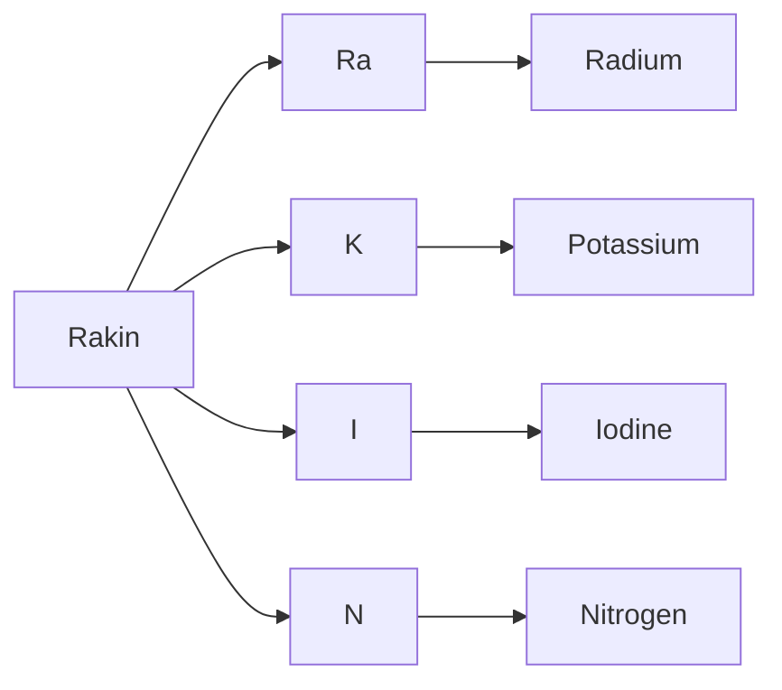

# elename 🥼
Get elements from any words. This is just a useless fun program I made to get
elements from me and my friend's names.

## What it does 🥽
For example, my name is Rakin. If I input this name, the program will print
all the elements available in it.

**Rakin** -> **Radium**, **Potassium**, **Iodine**, **Nitrogen**

Radium comes from "Ra" in **Ra**kin, Potassium comes from 'K' in Ra**k**in and
so on.

---

I wrote an elements header file which people can use in their code.
The symbols are all in *lowercase* though, because it's easier to parse.

---



## Installation and usage
```shell
git clone https://gitlab.com/rakinhacker/elename.git
cd elename
make
cd build
./elename
```
